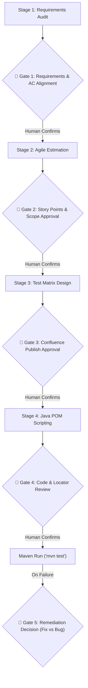

# Enterprise QA Automation Guidelines for GitHub Copilot in VS Code (Java Edition)

## Project Stack & Standards
- **Language**: Java 17+ (Maven)
- **Framework**: Microsoft Playwright for Java (`com.microsoft.playwright:playwright`)
- **Test Runner**: JUnit 5 (`org.junit.jupiter`) + AssertJ (`org.assertj.core`)
- **Target Application**: OrangeHRM Open Source Demo (https://opensource-demo.orangehrmlive.com/)
- **Architecture Pattern**: Strict Page Object Model (POM) under `src/main/java/com/orangehrm/pages/`
- **Tests Location**: `src/test/java/com/orangehrm/tests/`

---

## 🛑 MANDATORY HUMAN-IN-THE-LOOP (HITL) GOVERNANCE PROTOCOL
**Core Rule: Agents must NEVER make autonomous assumptions on business requirements, code modifications, documentation publishing, or bug filing. Every major stage requires explicit human confirmation.**



### The 5 Human Confirmation Gates:
1. **Gate 1: Requirements & AC Clarification (Zero-Presumption Policy)**:
   - If user story requirements are incomplete, ambiguous, or missing edge cases, **the agent MUST NOT guess or invent business logic**.
   - The agent must pause, present specific clarifying questions, and wait for human confirmation before proceeding to test design.
2. **Gate 2: Estimation & Sizing Approval**:
   - Present the breakdown (Design, Execution, POM Automation, 20% Defect Buffer) and confirm story point consensus with the QA Lead.
3. **Gate 3: Confluence Documentation Sign-Off**:
   - Before publishing or updating any page in Confluence Cloud, display the test matrix summary and ask: *"Do you approve publishing this test matrix to Confluence?"*
4. **Gate 4: Test Architecture & Locator Sign-Off**:
   - Outline proposed Page Object methods and locators (`getByRole`, `getByLabel`). Verify alignment with team POM conventions before writing files.
5. **Gate 5: Self-Healing & Defect Remediation Sign-Off**:
   - On test failure, inspect Playwright Traces (`target/traces/*.zip`) and console logs (`target/logs/*.log`).
   - Present root cause and proposed diff. **NEVER overwrite code autonomously**. Wait for the engineer to choose: `[1] Apply Fix`, `[2] File Jira Defect`, or `[3] Inspect Trace Visually`.

---

## 1. Page Object Model (POM) Rules
- Every Page Object extends `BasePage` and accepts a `com.microsoft.playwright.Page` instance in its constructor.
- Never write raw assertions inside Page Object methods; encapsulate user workflows (e.g., `login(...)`, `submitAssignment()`).
- Expose state queries returning boolean or counts (e.g., `isUserLoggedIn()`, `getRequiredErrorsCount()`).
- Encapsulate locators as private or protected fields; prioritize `page.getByRole(...)`, `page.getByPlaceholder(...)`, `page.getByText(...)`.
- **FORBIDDEN**: Absolute XPaths (`/html/body/...`) and volatile auto-generated CSS hashes.

---

## 2. Playwright Tracing & Failure Artifacts
- All tests extend `BaseTest`.
- Every test execution records:
  - **Console Logs**: Captured via `page.onConsoleMessage` and saved to `target/logs/<TestName>-console.log`.
  - **Playwright Trace**: Started in `@BeforeEach` with screenshots, snapshots, and sources. On failure, saved to `target/traces/<TestName>-trace.zip`.
  - **Screenshots**: Saved to `target/screenshots/<TestName>-failed.png`.
- Trace Viewer command:
  ```bash
  mvn exec:java -e -Dexec.mainClass=com.microsoft.playwright.CLI -Dexec.args="show-trace target/traces/<TestName>-trace.zip"
  ```
