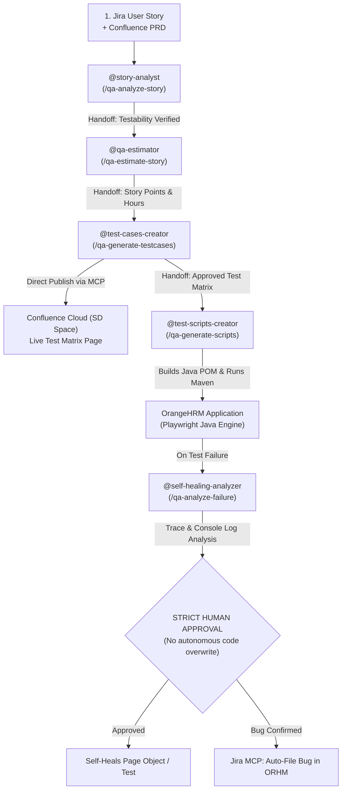

# 🚀 QA Agents Automation Plugin (`qa-agents-automation`)

> **Enterprise GitHub Copilot Agent Plugin (Agent Plugins 1.0 Standard)**  
> Centralized QA Automation, Jira Story Analysis, Agile Estimation, Confluence Publishing, Java Playwright POM, and Trace Viewer Self-Healing for entire engineering teams.

---

## 💡 Why This Repository Exists

Maintaining AI configurations (`.github/agents/`, `.github/prompts/`, `.github/hooks/`, `mcp.json`) in individual project repositories causes drift, overhead, and fragmentation across large QA teams.

**`AgentsAutomation`** packages your entire QA intelligence into an **Agent Plugin** conforming to the **Agent Plugins 1.0 standard**. Any tester or developer across your organization can install it with **a single command or Git URL**, instantly equipping VS Code with:
1. **5 Role-Based Custom Agents**
2. **6 Reusable Prompt Commands (`/`)**
3. **Atlassian Rovo MCP (Jira + Confluence Teamwork Graph)**
4. **Lifecycle Hooks & Security Gates**
5. **Strict Human-in-the-Loop Governance**

---

## 📦 Plugin Architecture (Agent Plugins 1.0)

```text
AgentsAutomation/
├── plugin.json                       <-- Canonical Agent Plugin 1.0 Manifest
├── marketplace.json                  <-- Marketplace Registry Catalog
├── mcp.json                          <-- Portable MCP Server Config (Atlassian Rovo v2)
├── skills/                           <-- Portable agent skills
│   └── java-pom-generator/SKILL.md
├── com.github.copilot/               <-- Copilot Agent Assets
│   ├── agents/
│   │   ├── qa-orchestrator.agent.md  <-- 🎯 MASTER ORCHESTRATOR & CONDUCTOR
│   │   ├── story-analyst.agent.md    <-- 1. Story Analysis Specialist
│   │   ├── qa-estimator.agent.md     <-- 2. QA Estimation Specialist
│   │   ├── test-cases-creator.agent.md<-- 3. Confluence Test Matrix Publisher
│   │   ├── test-scripts-creator.agent.md<-- 4. Java Playwright SDET Agent
│   │   └── self-healing-analyzer.agent.md<-- 5. Trace Self-Healing Agent
│   ├── prompts/
│   │   ├── qa-orchestrate.prompt.md  <-- /qa-orchestrate (Natural Language Entrypoint)
│   │   ├── qa-analyze-story.prompt.md
│   │   ├── qa-estimate-story.prompt.md
│   │   ├── qa-generate-testcases.prompt.md
│   │   ├── qa-generate-scripts.prompt.md
│   │   ├── qa-analyze-failure.prompt.md
│   │   └── qa-file-bug.prompt.md
│   ├── hooks/
│   │   └── qa-gates.json             <-- Guardrail to block destructive terminal commands
│   └── instructions/
│       ├── copilot-instructions.md   <-- Project-wide Java POM & Human-in-the-loop rules
│       └── e2e-tests.instructions.md <-- applyTo: "tests/e2e/**"
└── scripts/                          <-- Automated Atlassian REST seeders
```

---

## 🛠️ How Team Members Install & Use It (3 Distribution Methods)

### Method 1: Install Directly via Git Repository URL *(Fastest)*
Any developer or QA engineer can install the plugin directly into their local environment:
```bash
# Using GitHub Copilot CLI or VS Code Agent CLI:
copilot plugin install https://github.com/ravitamil/AgentsAutomation
```

### Method 2: Register as an Internal Marketplace in VS Code
To distribute across an entire engineering team via the VS Code GUI:
1. In VS Code, open **Settings** (`Ctrl + ,`) and search for:
   `chat.agentPlugins.marketplaces`
2. Add your repository URL:
   ```json
   "chat.agentPlugins.marketplaces": [
     "https://github.com/ravitamil/AgentsAutomation"
   ]
   ```
3. Open **Copilot Chat** in VS Code ➔ Click the **Configure Chat (Gear Icon)** ➔ Browse Marketplace ➔ Click **Install** on `qa-agents-automation`.
4. All agents, slash commands, and hooks activate immediately in **any repository they open**!

### Method 3: Organization-Wide Deployment (Zero Configuration for Users)
If your company uses a GitHub Organization:
1. Push this repository contents to your organization's default config repository:  
   `https://github.com/ravitamil/.github` or `ravitamil/.github-private`
2. Every engineer and QA member in the organization automatically inherits all custom agents and prompts across all repositories with **zero manual installation**.

---

## 🔄 The 5-Stage Agentic QA Workflow



---

## 🛡️ Enterprise Governance: Strict Human-in-the-Loop Policy
- **No Autonomous Code Overwriting**: When self-healing a failing test, Copilot inspects the Playwright Trace (`target/traces/*.zip`) and console logs, diagnoses the root cause, and displays a code diff. It **pauses and requests explicit confirmation** from the engineer before editing files.
- **PreToolUse Guardrails**: The included lifecycle hook (`qa-gates.json`) automatically blocks destructive commands (e.g., `rm -rf`, `drop table`, `git push --force`) before they can run.
- **Trace Viewer Integration**: Provides the exact Maven command to inspect interactive Playwright Traces visually on demand.
