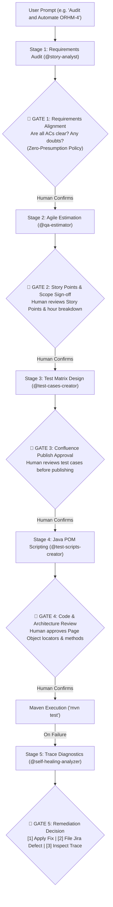

# 🚀 QA Agents Automation Plugin (`qa-agents-automation`)

> **Enterprise GitHub Copilot Agent Plugin (Agent Plugins 1.0 Standard)**  
> Centralized QA Automation, Jira Requirements Audit, Agile Estimation, Confluence Publishing, Java Playwright POM SDET, and Trace Viewer Self-Healing with 5-Gate Human-in-the-Loop Governance.

[](https://agent-plugins.org)
[](https://playwright.dev/java/)
[](https://mcp.atlassian.com)
[]()

---

## 💡 Why This Repository Exists

Maintaining AI configurations (`.github/agents/`, `.github/skills/`, `.github/hooks/`, `mcp.json`) manually inside individual project repositories leads to configuration drift, stale prompts, security loopholes, and overhead across engineering teams.

**`AgentsAutomation`** packages your entire enterprise QA intelligence into a modular, versioned **Agent Plugin** conforming strictly to the open **Agent Plugins 1.0 standard**. Any tester or developer across your organization can install it with **a single command or Git URL**, instantly equipping VS Code Copilot with:
1. **6 Role-Based Custom Agents** (Lead QA Orchestrator + 5 Specialists)
2. **9 Modular Agent Skills** (Replacing legacy `.prompt.md` files with intent-based auto-discovery)
3. **Official Cloud Atlassian Rovo MCP** (Direct Jira Cloud & Confluence Cloud integration)
4. **Lifecycle Hooks & Guardrails** (`hooks.json` blocking destructive operations)
5. **Mandatory 5-Stage Human-in-the-Loop (HITL) Governance Protocol**

---

## 📦 Plugin Architecture (Agent Plugins 1.0)

```text
AgentsAutomation/
├── plugin.json                       <-- Canonical Agent Plugins 1.0 Manifest (v1.3.0)
├── marketplace.json                  <-- Agent Plugins Marketplace Registry Catalog
├── mcp.json                          <-- Cloud-Hosted Atlassian Rovo MCP Endpoint
├── skills/                           <-- Portable Agent Skills (Agent Plugins 1.0 Standard)
│   ├── story-analysis/SKILL.md       <-- Audits Jira/Confluence requirements (Gate 1)
│   ├── qa-estimation/SKILL.md        <-- Calculates SP & effort breakdown (Gate 2)
│   ├── test-cases-creation/SKILL.md  <-- Generates & publishes test matrix to Confluence (Gate 3)
│   ├── test-scripts-automation/SKILL.md <-- Java Playwright POM script authoring (Gate 4)
│   ├── java-pom-generator/SKILL.md   <-- Java 17+ POM design patterns & locator templates
│   ├── self-healing-diagnosis/SKILL.md <-- Playwright Trace & console log root-cause analysis (Gate 5)
│   ├── jira-bug-creator/SKILL.md     <-- Structured defect logger for Jira ORHM
│   ├── jira-to-test-pipeline/SKILL.md<-- Complete end-to-end user story automation pipeline
│   └── qa-orchestration/SKILL.md     <-- Multi-agent conductor and graph planner
├── com.github.copilot/               <-- GitHub Copilot Extension Namespace
│   ├── agents/                       <-- Custom Agents
│   │   ├── qa-orchestrator.agent.md  <-- 🎯 Master Orchestrator & Conductor
│   │   ├── story-analyst.agent.md    <-- Requirements & Acceptance Criteria Specialist
│   │   ├── qa-estimator.agent.md     <-- Agile QA Sizing & Estimation Specialist
│   │   ├── test-cases-creator.agent.md<-- Confluence Test Matrix Publisher
│   │   ├── test-scripts-creator.agent.md<-- Java Playwright POM SDET
│   │   └── self-healing-analyzer.agent.md<-- Trace Artifact Self-Healing Specialist
│   ├── hooks/
│   │   └── hooks.json                <-- PreToolUse security gates & session audit hooks
│   └── instructions/
│       ├── copilot-instructions.md   <-- Project-wide Java POM & HITL rules
│       └── e2e-tests.instructions.md <-- Path-scoped instructions for src/test/java/**
├── .github/                          <-- Dual Repository-Level Compatibility Tree
│   ├── agents/
│   ├── hooks/
│   ├── instructions/
│   ├── plugin/
│   └── skills/
└── scripts/                          <-- REST API automation utilities
    ├── publish_confluence_testcases.py
    ├── seed_demo_data.py
    └── seed_expanded_suite.py
```

---

## 🧠 Why Agent Skills Replace Legacy Prompt Files

In previous versions of Copilot, teams relied on `.prompt.md` files. In the **Agent Plugins 1.0 standard** and modern GitHub Copilot Agent Host, standalone prompt files have transitioned to **Agent Skills (`skills/<skill-name>/SKILL.md`)**:

| Feature | Legacy Prompt Files (`.prompt.md`) | Modern Agent Skills (`SKILL.md`) |
| :--- | :--- | :--- |
| **Discovery** | Explicit slash command invocation only (`/qa-story`) | **Intent-Based Auto-Discovery** (Copilot invokes skill automatically based on task context) |
| **Packaging** | Flat text files | **Self-Contained Modules** (Markdown instructions, YAML metadata, bundled scripts) |
| **Cross-Tool Portability** | VS Code Copilot only | **Universal Open Standard** (Compatible with VS Code, Copilot CLI, Claude Code, Cursor) |
| **Tool Orchestration** | Cannot declare or bundle execution helpers | Bundles executable scripts (`scripts/publish_confluence_testcases.py`) |
| **Governance** | Unstructured instructions | Enforces explicit **Human-in-the-Loop Checkpoints** |

---

## 🛑 The 5 Mandatory Human-in-the-Loop (HITL) Gates



1. **Gate 1: Requirements Clarification (Zero-Presumption Policy)**: If any requirement is vague or lacks edge cases, the agent **MUST NOT guess**. It pauses and presents specific clarifying questions.
2. **Gate 2: Estimation & Sizing Approval**: Story Points and hours breakdown (Design, Execution, POM Automation, 20% Defect Buffer) are reviewed and confirmed by the QA Lead.
3. **Gate 3: Confluence Documentation Sign-Off**: The test matrix is previewed and approved before publishing to Confluence Cloud space `SD`.
4. **Gate 4: Test Architecture & Locator Sign-Off**: Proposed Java Page Object methods and Playwright locators (`getByRole`, `getByLabel`) are approved before code generation.
5. **Gate 5: Self-Healing & Defect Remediation Sign-Off**: On test failure, Playwright Traces and console logs are analyzed. **Code is NEVER overwritten autonomously**. The engineer chooses to apply the diff, file a Jira bug, or inspect the interactive trace viewer.

---

## 🛠️ How Team Members Install & Use It

### Method 1: Register as an Internal Marketplace in VS Code *(Recommended for Teams)*
1. Open VS Code **Settings** (`Ctrl + ,`) and search for:
   `chat.agentPlugins.marketplaces`
2. Add your repository URL:
   ```json
   "chat.agentPlugins.marketplaces": [
     "https://github.com/ravitamil/AgentsAutomation"
   ]
   ```
3. Open **Copilot Chat** ➔ Click the **Gear Icon** (Configure Chat) ➔ Browse Marketplace ➔ Click **Install** on `qa-agents-automation`.
4. All 6 agents, 9 skills, and hooks become active across every workspace opened in VS Code.

### Method 2: Direct Install via GitHub Copilot CLI
```bash
copilot plugin install https://github.com/ravitamil/AgentsAutomation
```

### Method 3: Team-Wide Auto-Inheritance via Organization Default
Push this repository's contents to your GitHub organization's default config repository (`.github` or `.github-private`). All organization members automatically inherit all agents and skills without any manual workstation setup.

---

## 🧪 Quickstart Usage in Any Testing Repo

In any consumer repository (e.g. `qa-copilot-demo`):

```bash
# 1. Ask the Master Orchestrator to run an end-to-end flow:
@qa-orchestrator Plan and execute testing for Jira Story ORHM-4

# 2. Directly invoke specialized agents:
@story-analyst Audit Jira Story ORHM-2 and Confluence PRD for ambiguities
@qa-estimator Estimate QA effort and Story Points for ORHM-5
@test-cases-creator Generate manual test matrix for ORHM-4 and publish to Confluence
@test-scripts-creator Convert approved ORHM-4 test cases into Java Playwright POM tests
@self-healing-analyzer Diagnose failed test SimulatedFailureTest using Playwright traces

# 3. View interactive Playwright Trace Viewer locally:
mvn exec:java -e -Dexec.mainClass=com.microsoft.playwright.CLI -Dexec.args="show-trace target/traces/<TestName>-trace.zip"
```

---

## 🔒 Security Guardrails (`hooks.json`)

The plugin includes an active pre-execution policy gate that automatically blocks harmful terminal commands before execution:
- Blocks destructive commands: `rm -rf`, `drop table`, `git push --force`, `format`.
- Logs session start and tool completion events for complete QA audit trails.
